# Analis CV Otomatis dengan n8n dan Google Gemini

[](https://n8n.io/)
[](https://www.docker.com/)
[](https://deepmind.google/technologies/gemini/)
[](https://opensource.org/licenses/MIT)

Repositori ini berisi alur kerja (workflow) n8n untuk mengotomatiskan proses analisis dan penilaian CV, dari file PDF yang diunggah di Google Drive hingga hasil terstruktur di Google Sheets, dengan evaluasi cerdas dari AI Google Gemini.

---
# Automated CV Analysis & Scoring Pipeline with n8n and Google Gemini


[](https://n8n.io/)


## flowchart Alur Kerja

```mermaid
graph TD
    subgraph "Proses Manual"
        A["📄 User: Unggah CV (.pdf)"] --> B["📂 Google Drive"];
    end

    subgraph "Proses Otomatis n8n"
        C(1. Google Drive Trigger <br><i>Mendeteksi file baru</i>) --> D(2. Download File <br><i>Mengunduh file dari Drive</i>);
        D --> E(3. Extract from PDF <br><i>Membaca teks dari PDF</i>);
        E --> F(4. AI Agent <br><i>Mengirim teks ke Google Gemini</i>);
        F --> G(5. Parse JSON <br><i>Memastikan output AI valid</i>);
        G --> H(6. Google Sheets <br><i>Menyimpan hasil analisis</i>);
    end

    subgraph "Output"
        I["📊 Google Sheets <br><i>Hasil akhir tersimpan</i>"];
    end

    B --> C;
    H --> I;
```



---

## 🎯 Konsep Proyek

Proses penyaringan (screening) CV secara manual memakan banyak waktu dan rentan terhadap bias. Proyek ini bertujuan untuk memecahkan masalah tersebut dengan menciptakan sebuah sistem otomatis yang dapat:

1. **Mendeteksi** CV baru yang masuk.
2. **Membaca** dan **memahami** isi CV tersebut.
3. **Mengekstrak** informasi-informasi kunci secara terstruktur.
4. **Memberikan penilaian** (skor) objektif berdasarkan kriteria yang telah ditentukan menggunakan AI.
5. **Menyajikan** hasilnya dalam format tabel yang mudah diakses dan disaring oleh tim HR.

Dengan ini, tim HR dapat fokus pada kandidat-kandidat paling potensial berdasarkan analisis data awal yang konsisten dan cepat.

---

## ✨ Fitur Utama

- **Otomatisasi Penuh**: Cukup unggah CV ke folder Google Drive, dan biarkan sistem bekerja.
- **Ekstraksi Data Cerdas**: Mengambil informasi penting seperti nama, kontak, pengalaman kerja, keahlian, dan pendidikan.
- **Penilaian Berbasis AI**: Memberikan skor kuantitatif (1-100) pada setiap CV menggunakan Google Gemini untuk evaluasi yang objektif.
- **Penyimpanan Terpusat**: Menyimpan semua data dan skor secara rapi di Google Sheets.
- **Mudah Diadaptasi**: Dibangun di atas n8n, alur kerja ini dapat dengan mudah dimodifikasi atau diintegrasikan dengan layanan lain (misalnya, mengirim notifikasi ke Slack).

---

## 🛠️ Tumpukan Teknologi (Tech Stack)

- **Platform Otomatisasi**: [n8n.io](https://n8n.io/)
- **Deployment**: Docker
- **Penyimpanan File**: Google Drive
- **Model AI**: Google Gemini (melalui Vertex AI API)
- **Penyimpanan Data**: Google Sheets

---

## 🚀 Panduan Instalasi dan Konfigurasi

Berikut adalah langkah-langkah detail untuk menjalankan proyek ini dari awal.

### Prasyarat

- [Docker](https://www.docker.com/products/docker-desktop/) dan Docker Compose terinstal di komputer Anda.
- Akun Google dan akses ke [Google Cloud Console](https://console.cloud.google.com/).
- File workflow `cv-analysis-workflow.json` dari repositori ini.

### Langkah 1: Setup n8n dengan Docker

Cara termudah dan terekomendasi untuk menjalankan n8n adalah menggunakan Docker, karena memastikan lingkungan kerja yang konsisten.

1. Buat sebuah folder baru untuk proyek Anda, misalnya `cv-analyzer`.
2. Di dalam folder tersebut, buat file bernama `docker-compose.yml`.
3. Salin dan tempel konfigurasi berikut ke dalam file `docker-compose.yml` Anda:

   ```yaml
   version: '3.8'

   services:
     n8n:
       image: n8nio/n8n:latest
       container_name: n8n_cv_analyzer
       restart: always
       ports:
         - "5678:5678"
       environment:
         - GENERIC_TIMEZONE=Asia/Jakarta
       volumes:
         - ./n8n_data:/home/node/.n8n

   volumes:
     n8n_data:
   ```

   > **Catatan**: Volume `./n8n_data` akan dibuat di folder Anda untuk menyimpan data n8n (workflow, kredensial) secara persisten.
   >
4. Buka terminal atau command prompt, arahkan ke folder proyek Anda, dan jalankan perintah:

   ```bash
   docker-compose up -d
   ```
5. Tunggu beberapa saat. Setelah selesai, n8n akan dapat diakses melalui browser di `http://localhost:5678`.

### Langkah 2: Setup Akun n8n & Impor Workflow

1. Buka `http://localhost:5678` untuk pertama kalinya. Anda akan diminta untuk membuat akun pemilik (owner). Ikuti langkah-langkahnya.
2. Setelah masuk ke dasbor n8n, buat workflow baru (atau buka workflow default).
3. Impor workflow dari repositori ini dengan cara **File > Import > From File...** dan pilih file `cv-analysis-workflow.json`.

### Langkah 3: Konfigurasi API Google (Paling Penting)

Alur kerja ini memerlukan otorisasi untuk mengakses Google Drive, Sheets, dan Gemini. Anda perlu membuat kredensial OAuth 2.0.

1. **Buka Google Cloud Console**: Pergi ke [https://console.cloud.google.com/](https://console.cloud.google.com/) dan buat proyek baru (misalnya, "n8n-cv-analyzer").
2. **Aktifkan API yang Dibutuhkan**: Di dalam proyek Anda, pergi ke "APIs & Services" > "Library" dan aktifkan API berikut:

   - **Google Drive API**
   - **Google Sheets API**
   - **Vertex AI API** (untuk akses ke model Gemini)
3. **Konfigurasi OAuth Consent Screen**:

   - Pergi ke "APIs & Services" > "OAuth consent screen".
   - Pilih **External** dan klik "Create".
   - Isi nama aplikasi (misalnya, "n8n CV Analyzer"), email Anda, dan informasi kontak developer. Simpan dan lanjutkan.
   - Pada bagian "Scopes" dan "Test users", Anda bisa melewatinya untuk saat ini. Simpan dan kembali ke dashboard.
   - **Publikasikan aplikasi** (Publish App) agar dapat digunakan.
4. **Buat Kredensial OAuth 2.0**:

   - Pergi ke "APIs & Services" > "Credentials".
   - Klik **+ CREATE CREDENTIALS** dan pilih **OAuth client ID**.
   - Pilih **Web application** sebagai tipe aplikasi.
   - Beri nama (misalnya, "n8n Web Client").
   - Di bagian **Authorized redirect URIs**, klik **+ ADD URI**. Anda perlu memasukkan URL callback dari n8n.
     - Untuk mendapatkannya, buka n8n Anda, pergi ke **Credentials > Add credential**, cari **Google OAuth2 API**, dan salin **OAuth Callback URL** yang ditampilkan di sana. Tempelkan ke kolom di Google Cloud Console.
   - Klik **CREATE**. Anda akan mendapatkan **Client ID** dan **Client Secret**. Simpan ini baik-baik!

### Langkah 4: Hubungkan Kredensial di n8n

1. Kembali ke n8n, pergi ke **Credentials** di panel kiri.
2. Klik **Add credential**, cari dan pilih **Google OAuth2 API**.
3. Tempelkan **Client ID** dan **Client Secret** yang Anda dapatkan dari Google Cloud Console.
4. Klik **Sign in with Google** dan ikuti proses otorisasi. Pastikan untuk memberikan izin ke Drive dan Sheets.
5. Ulangi proses yang sama untuk kredensial **Google Vertex AI** jika diperlukan (biasanya menggunakan API Key atau Service Account).
6. Setelah kredensial dibuat, buka setiap node di workflow (Google Drive, Google Sheets) dan pilih kredensial yang baru saja Anda buat dari daftar dropdown.

---

## 📖 Cara Penggunaan

1. Pastikan semua node sudah terkonfigurasi dengan kredensial yang benar.
2. Aktifkan workflow dengan mengklik tombol **Active** di pojok kanan atas.
3. Unggah sebuah file CV (dalam format .pdf) ke folder Google Drive yang telah Anda tentukan di node **Google Drive Trigger**.
4. Alur kerja akan berjalan secara otomatis. Periksa tab **Executions** di n8n untuk melihat statusnya.
5. Buka file Google Sheet Anda untuk melihat baris baru yang berisi hasil analisis CV.

---

## ⚠️ Troubleshooting

- **Error 403 / Permission Denied**: Pastikan API yang relevan (Drive, Sheets, Vertex AI) sudah diaktifkan di Google Cloud Console.
- **Redirect URI Mismatch**: Pastikan URL callback di kredensial n8n Anda sama persis dengan yang terdaftar di "Authorized redirect URIs" di Google Cloud Console.
- **AI Output Error**: Jika AI gagal menghasilkan JSON yang valid, periksa kembali prompt Anda. Pastikan ada instruksi yang sangat tegas untuk hanya mengembalikan format JSON.

---

## 📄 Lisensi

Proyek ini dilisensikan di bawah Lisensi MIT. Lihat file `LICENSE` untuk detailnya.

